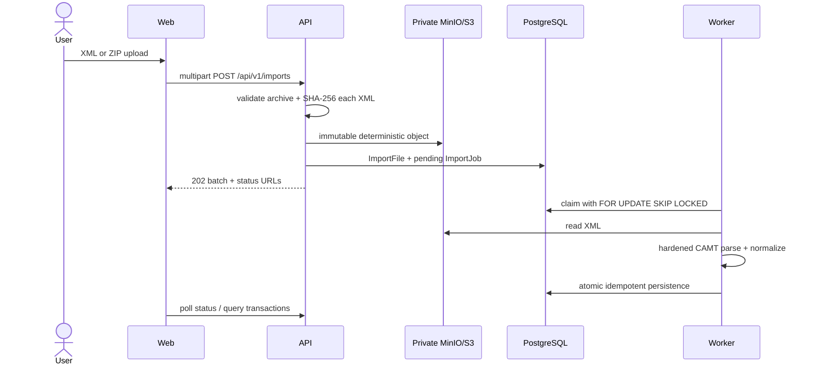

# Finance Inzicht

Production-oriented milestone-one bank-data ingestion: upload CAMT.053 XML or a ZIP batch, store immutable sources privately in MinIO, process jobs concurrently through PostgreSQL, and view normalized accounts and transactions. This is deliberately not an accounting ledger and includes no PSD2 connection, payments, categorization, budgeting, or authentication.

## Start

Requirements: Docker, or .NET SDK 10.0 plus Node 26.5.0. Copy `.env.example` to `.env` and replace credentials, then run:

```sh
docker compose up --build
```

Viewer: http://localhost:4200 · Design system: http://localhost:6006 · Swagger: http://localhost:8080/swagger · MinIO console: http://localhost:9001. The API and worker create the schema on startup for milestone one; use reviewed EF migrations instead of `EnsureCreated` before evolving a production database.

## Application and design-system workspace

The reusable design system is maintained in the separate
[Finance-DesignSystem](https://github.com/Endeavoury/Finance-DesignSystem)
repository. The two repositories live beside each other, so local development
tools and Codex can inspect both without mixing their working trees or history.

```text
Finance-Inzicht/
├── application/  → Endeavoury/Finance-Inzicht
└── design/       → Endeavoury/Finance-DesignSystem
```

Create the application checkout, then let the setup script prepare the sibling
design repository:

```sh
mkdir Finance-Inzicht && cd Finance-Inzicht
git clone git@github.com:Endeavoury/Finance-Inzicht.git application
cd application
./scripts/setup-workspace.sh
```

The setup script clones or updates `../design`, builds its packages, and
installs the web application's dependencies.

When a change affects both repositories, commit and push from each sibling
repository independently. Run `docker compose up --build` from `application/`
to start the application and the sibling design-system Storybook together.

## Offline use

After a successful sign-in, the web app stores a user-scoped snapshot of the dashboard, monthly/year views, transactions, imports, and account settings in IndexedDB. The application shell is installed by a service worker, so the frontend can be reopened and browsed when the API or network is unavailable. Filters and monthly views are calculated from the saved snapshot where possible.

Edits, user-management changes, and CAMT uploads made offline are queued in the browser and replayed in order when the server is reachable again. The interface shows offline and pending-sync status. A user must sign in online at least once on that browser; browser storage limits also apply to queued XML/ZIP files.

## Architecture



`Domain` has entities only. `Application` owns importer and storage boundaries plus normalization. `Camt` is the first `ITransactionSourceImporter`. `Infrastructure` owns EF/PostgreSQL, MinIO, and safe job claiming. API never parses CAMT; Worker never accepts HTTP. Future CAMT.052/.054, MT940, CSV, and AISP connectors implement the same importer interface without coupling application services to CAMT.

## Upload and mapping decisions

- Supports namespace-aware CAMT.053.001.02, .04, and .08. DTDs and external resolution are prohibited; XML is limited to 50 MiB.
- ZIP uploads are limited to 2 GiB compressed, 10,000 XML files, 50 MiB per XML, 10 GiB total expanded, and a 100:1 entry compression ratio. Directories are ignored; non-XML and nested archives are rejected; filenames are reduced to their basename.
- A ZIP creates one independent immutable file/job per XML. Exact SHA-256 duplicates receive `Duplicate` jobs and are never re-uploaded or parsed.
- One `TxDtls` maps to one normalized transaction. Multiple details expand to multiple transactions and prefer detail amounts; a warning records the expansion. Entries without details still produce one transaction from entry-level fields.
- Debit entries prefer creditor party/account/agent; credits prefer debtor fields. Missing values stay null. IBANs are uppercase without whitespace.
- A SHA-256 fingerprint combines account, dates, exact decimal amount, currency, direction, stable references, counterparty IBAN, and normalized remittance. It never deduplicates on date/amount alone. Statement and fingerprint uniqueness make retries idempotent.
- Money is `decimal`; currency is explicit. Raw *normalized fragments* use JSONB. Raw XML is private and is never returned by list APIs.
- Free text currently uses PostgreSQL `ILIKE`. This is simple but becomes a sequential search at scale; add a generated `tsvector`/GIN index when production volume warrants it.

## API

All business routes are under `/api/v1`: imports (upload/list/detail/retry/warnings), accounts (list/detail/statements/transactions), statements (detail/transactions), and transactions (list/detail). Transaction list supports account, statement, dates, amount range, direction, currency, search, stable descending sort, and pagination capped at 200. Errors use ASP.NET Problem Details; correlation IDs are echoed as `X-Correlation-ID`.

## Development and tests

```sh
dotnet restore
dotnet build FinanceInzicht.slnx
dotnet test FinanceInzicht.slnx
cd src/Web
npm install
npm run build
```

Upload without the UI: `curl -F "file=@samples/camt/simple.xml" http://localhost:8080/api/v1/imports`. Configuration uses `ConnectionStrings__Postgres` and `ObjectStorage__Endpoint`, `__AccessKey`, `__SecretKey`, `__Bucket`, and `__Secure` environment variables.

## Container CI/CD

GitHub Actions validates the .NET solution and Angular application for pull requests to `master`. On pushes to `master` and version tags beginning with `v`, it publishes the following GitHub Container Registry images:

- `ghcr.io/endeavoury/finance-inzicht-api`
- `ghcr.io/endeavoury/finance-inzicht-worker`
- `ghcr.io/endeavoury/finance-inzicht-web`

Each published image has an immutable `sha-…` tag; `master` publishes `latest` too, and release tags add semantic version tags. The workflow uses the repository `GITHUB_TOKEN`, so no manually stored registry password is needed. In repository settings, ensure **Actions → General → Workflow permissions** permits read/write access, and configure package visibility/access in GitHub Packages as appropriate for the deployment environment.

## Security, privacy, limitations, roadmap

Do not expose milestone one publicly: it intentionally lacks identity and authorization. Use TLS, a secrets manager, private networks, malware scanning, retention policies, backups, per-tenant authorization, and audit logging before production. Logs carry job/correlation identifiers but not transaction bodies or full IBANs. See `SECURITY.md`.

Next: formal EF migrations, generated OpenAPI client, richer Angular detail/filter UI, Testcontainers integration coverage and Playwright smoke test; then authentication/authorization and operational metrics. Later source adapters may add CAMT.052/.054, MT940/CSV, GoCardless, Enable Banking, and direct licensed AISP integrations. A separate future ledger module will create balanced accounting postings; imported bank transactions remain source facts and are not presented as journal entries.
